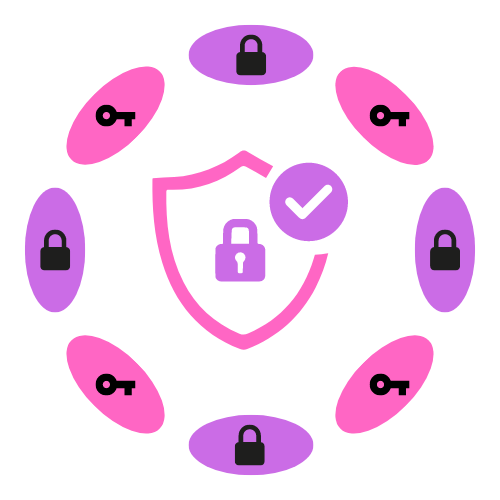
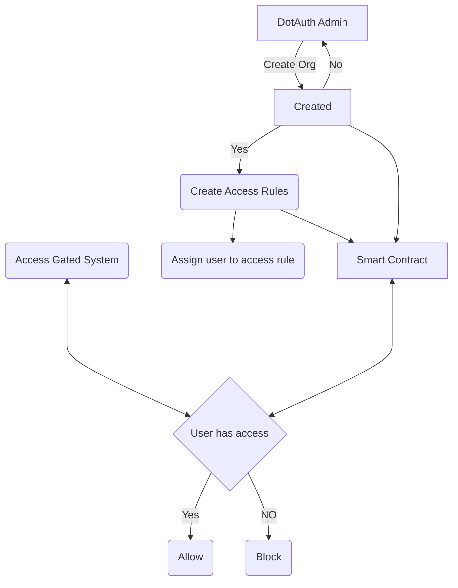

<a name="readme-top"></a>

[![Contributors][contributors-shield]][contributors-url]
[![Forks][forks-shield]][forks-url]
[![Stargazers][stars-shield]][stars-url]
[![Issues][issues-shield]][issues-url]
[![MIT License][license-shield]][license-url]
[![LinkedIn][linkedin-shield]][linkedin-url]


<!-- PROJECT LOGO -->
<br />
<div align="center">
  <a href="https://github.com/mothupir/DotAuth">
    
  </a>

  <h3 align="center">DotAuth</h3>

  <p align="center">
    Identity and Access Management platform for businesses built on Polkadot's Moonbeam EVM chain
    <br />
    <a href="https://github.com/mothupir/DotAuth"><strong>Explore the docs »</strong></a>
    <br />
    <br />
    <a href="https://link to youtube video">View Demo</a>
    ·
    <a href="https://github.com/mothupir/DotAuth/issues">Report Bug</a>
    ·
    <a href="https://github.com/mothupir/DotAuth/issues">Request Feature</a>
  </p>
</div>


<!-- TABLE OF CONTENTS -->
<details>
  <summary>Table of Contents</summary>
  <ol>
    <li>
      <a href="#about-the-project">About The Project</a>
      <ul>
        <li><a href="#built-with">Built With</a></li>
      </ul>
    </li>
    <li>
      <a href="#getting-started">Getting Started</a>
      <ul>
        <li><a href="#prerequisites">Prerequisites</a></li>
        <li><a href="#installation">Installation</a></li>
      </ul>
    </li>
    <li><a href="#usage">Usage</a></li>
    <li><a href="#roadmap">Roadmap</a></li>
    <li><a href="#contributing">Contributing</a></li>
    <li><a href="#license">License</a></li>
    <li><a href="#contact">Contact</a></li>
    <li><a href="#acknowledgments">Acknowledgments</a></li>
  </ol>
</details>


<!-- ABOUT THE PROJECT -->
## About The Project


DotAuth is an Identity and Access Management platform for businesses built on the Filecoin Ethereum Virtual Machine. Our solution makes it easier to manage access to proprietary systems and software. The current MVP allows organizations to create access rules and assign them to users. Our plan is to incorporate an AuthWallet in the next iteration to provide users with a secure way to store all their access tokens.

Here's why:

* DotAuth provides added security to organizations by removing a lot of the administration around access management. The AuthWallet allows users to store all their access tokens in one secure place. The DotAuth platform also ensures that access rules and tokens are updated regularly, minimizing the chances of unauthorized access. This provides businesses with peace of mind and a secure environment for their users.

* DotAuth has a range of features that make it a great choice for businesses looking for an Identity and Access Management solution. It provides a secure way to store access tokens, and allows organizations to update access rules regularly. DotAuth also allows users to easily manage their access tokens, and provides businesses with a secure environment for their users. It also has a range of customization options to suit the needs of any organization.


The future of DotAuth is bright. We plan to incorporate additional features and customization options to ensure that it meets the needs of any organization. We are also looking into incorporating additional security measures to provide businesses with even more peace of mind. We are also looking into developing more advanced features such as an artificial intelligence-based access control system, and a system for managing access to cloud-based services. This will help to ensure that DotAuth remains a secure and reliable Identity and Access Management platform for businesses.


<p align="right">(<a href="#readme-top">back to top</a>)</p>


### Built With

List of major frameworks/libraries used to bootstrap dotAuth.

* [![RemixIDE][remix.ethereum.org]][Remix-url]
* [![Ethers][Ethers.js]][Ethers-url]
* [![Moonbeam][Moonbeam.network]][Moonbeam-url]
* [![Angular][Angular.io]][Angular-url]

<p align="right">(<a href="#readme-top">back to top</a>)</p>

### Application Architecture flow.



## Getting Started

Instructions on setting up the project locally.
To get a local copy up and running follow these simple example steps.

### Prerequisites

This is an example of how to list things you need to use the software and how to install them.

* Docker for [Windows/Mac/Linux](https://docs.docker.com/get-docker/)


### Installation

Below is an example of how you can start installing and setting up the app locally.

* A prebuilt docker image is readily available in the Docker-Image folder which you can run with the Docker command.

* Alternatively follow below:

1. Clone the repo
   ```sh
   git clone https://github.com/mothupir/DotAuth.git
   ```
3. cd into repo
   ```sh
   cd  DotAuth
   ```
4. Build with docker
   ```sh
   $docker build -t <name-of-image> .
   ```
5. Run with docker
   ```sh
   $docker run -d -p <your-port>:80 <name-of-image>
   ```
6. Open your browser at the specified port.

<p align="right">(<a href="#readme-top">back to top</a>)</p>


<!-- USAGE EXAMPLES -->
## Usage

Demo video: [https://youtu.be/mtcGJLqD41M](https://youtu.be/mtcGJLqD41M)

<p align="right">(<a href="#readme-top">back to top</a>)</p>


<!-- ROADMAP -->
## Roadmap

- [x] Add Changelog
- [x] Hackathon MVP
- [ ] Fix UI and improve UX
- [ ] Add embeddable components and API access
- [ ] Build dotAuth-Wallet for access storage
    - [ ] Release for beta
    - [ ] Public release

See the [open issues](https://github.com/mothupir/DotAuth/issues) for a full list of proposed features (and known issues).

<p align="right">(<a href="#readme-top">back to top</a>)</p>


<!-- CONTRIBUTING -->
## Contributing

Contributions are what make the open source community such an amazing place to learn, inspire, and create. Any contributions you make are **greatly appreciated**.

If you have a suggestion that would make this better, please fork the repo and create a pull request. You can also simply open an issue with the tag "enhancement".
Don't forget to give the project a star! Thanks again!

1. Fork the Project
2. Create your Feature Branch (`git checkout -b feature/AmazingFeature`)
3. Commit your Changes (`git commit -m 'Add some AmazingFeature'`)
4. Push to the Branch (`git push origin feature/AmazingFeature`)
5. Open a Pull Request

<p align="right">(<a href="#readme-top">back to top</a>)</p>


<!-- LICENSE -->
## License

Distributed under the MIT License. See `LICENSE.txt` for more information.

<p align="right">(<a href="#readme-top">back to top</a>)</p>


<!-- CONTACT -->
## Contact

Discord - [@mothupir#2900](https://discord.com/channels/@mmothupir#2900)

Project Link: [https://github.com/mothupir/DotAuth](https://github.com/mothupir/DotAuth)

<p align="right">(<a href="#readme-top">back to top</a>)</p>


<!-- ACKNOWLEDGMENTS -->
## Acknowledgments

Use this space to list resources you find helpful and would like to give credit to. I've included a few of my favorites to kick things off!

* [Ethers](https://docs.ethers.org/v5/)
* [Moonbeam](https://docs.moonbeam.network/)
* [Polkadot](https://polkadot.network/)
* [Remix](https://remix.ethereum.org/)

<p align="right">(<a href="#readme-top">back to top</a>)</p>


<!-- MARKDOWN LINKS & IMAGES -->
<!-- https://www.markdownguide.org/basic-syntax/#reference-style-links -->
[contributors-shield]: https://img.shields.io/github/contributors/mothupir/DotAuth.svg?style=for-the-badge
[contributors-url]: https://github.com/mothupir/DotAuth//graphs/contributors
[forks-shield]: https://img.shields.io/github/forks/mothupir/DotAuth.svg?style=for-the-badge
[forks-url]: https://github.com/mothupir/DotAuth/network/members
[stars-shield]: https://img.shields.io/github/stars/mothupir/DotAuth.svg?style=for-the-badge
[stars-url]: https://github.com/othneildrew/Best-README-Template/stargazers
[issues-shield]: https://img.shields.io/github/issues/mothupir/DotAuth.svg?style=for-the-badge
[issues-url]: https://github.com/mothupir/DotAuth/issues
[license-shield]: https://img.shields.io/github/license/mothupir/DotAuth.svg?style=for-the-badge
[license-url]: https://github.com/mothupir/DotAuth/blob/master/LICENSE.txt
[linkedin-shield]: https://img.shields.io/badge/-LinkedIn-black.svg?style=for-the-badge&logo=linkedin&colorB=555
[linkedin-url]: https://www.linkedin.com/in/mothupi-ramogayana-68849480/
[moonbeam.network]: https://img.shields.io/badge/moonbeam-000000?style=for-the-badge&logo=remixethereum&logoColor=white
[Moonbeam-url]: https://docs.moonbeam.network/
[remix.ethereum.org]: https://img.shields.io/badge/remix-000000?style=for-the-badge&logo=remixethereum&logoColor=white
[Remix-url]: https://remix.ethereum.org/
[Ethers.js]: https://img.shields.io/badge/Ethers.js-000500?style=for-the-badge&logo=ethers&logoColor=blue
[Ethers-url]: https://docs.ethers.org/v6/
[Angular.io]: https://img.shields.io/badge/Angular-DD0031?style=for-the-badge&logo=angular&logoColor=white
[Angular-url]: https://angular.io/
